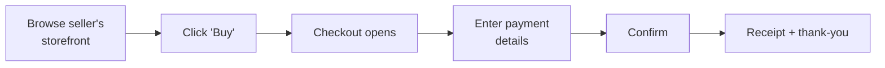

# Embedded checkout

The checkout is where the buyer pays the seller. On a Connect platform, the checkout looks slightly different than on a single-merchant Payments site — the receipt mentions both the platform and the seller, the application fee may be disclosed, and refunds flow back through the platform.

You have three integration shapes to choose from. Most platforms start with **hosted** for speed and migrate to **embedded** once they want the URL to stay branded.

## Three shapes

<table data-view="cards"><thead><tr><th></th><th></th><th></th><th data-hidden data-card-target data-type="content-ref"></th></tr></thead><tbody><tr><td><h3><i class="fa-link" style="color:$primary;">:link:</i></h3></td><td><strong>Hosted</strong></td><td>Redirect to an Evolve-hosted page. Fastest setup, fewest knobs.</td><td><a href="hosted-vs-embedded.md">hosted-vs-embedded.md</a></td></tr><tr><td><h3><i class="fa-window-maximize" style="color:$primary;">:window-maximize:</i></h3></td><td><strong>Embedded</strong></td><td>Drop-in checkout inside your own site. URL stays yours.</td><td><a href="hosted-vs-embedded.md">hosted-vs-embedded.md</a></td></tr><tr><td><h3><i class="fa-paint-roller" style="color:$primary;">:paint-roller:</i></h3></td><td><strong>Customization</strong></td><td>Theme, fields, language, and the seller branding shown.</td><td><a href="customization.md">customization.md</a></td></tr></tbody></table>

## What the buyer sees

A typical buyer experience takes 30–60 seconds. The moments worth thinking about as a platform:


{% column width="50%" %}

### <i class="fa-id-card" style="color:$primary;">:id-card:</i> Whose name is on the statement?

The descriptor on the buyer's card statement can be either the platform's, the seller's, or a combination. Most platforms use `PLATFORM*SELLER` — your platform name first, then the seller's name. Configurable per-seller.



{% column width="50%" %}

### <i class="fa-receipt" style="color:$primary;">:receipt:</i> Whose receipt do they get?

Receipts come from `receipts@evolve.com` on the platform's behalf, with the seller's name and your platform name as co-senders. Customers reply-to defaults to the seller's support address (configurable).





{% column width="50%" %}

### <i class="fa-rotate-left" style="color:$primary;">:rotate-left:</i> Where do refund requests go?

Most platforms surface a "Refund" button on the seller's storefront, not on the receipt. The customer asks the seller for a refund; the seller issues it from your platform's UI. See [Refunds and disputes](../platform-setup/refunds-and-disputes.md).



{% column width="50%" %}

### <i class="fa-shield-halved" style="color:$primary;">:shield-halved:</i> Who handles disputes?

Disputes are filed against the platform's merchant ID (since you're the merchant of record), but the platform usually delegates them to the seller — with a deadline and a default outcome if the seller doesn't respond. Configurable in **Settings → Connect → Disputes**.




## What the seller sees

In their portal (whether you build it or use Evolve's hosted seller dashboard), each seller sees:

* The transactions they were the seller on.
* The application fees taken out.
* Their balance and upcoming payouts.
* Any open disputes assigned to them.

They do **not** see other sellers' transactions or platform-level reporting.

## Where to start

* **If you've never integrated payments** — start with [Buyer experience](buyer-experience.md) to get the high-level mental model.
* **If you're choosing an integration** — read [Hosted vs embedded](hosted-vs-embedded.md).
* **If you've decided on embedded** — head straight to [Customization](customization.md).

## Related

* [Onboarding sellers](../platform-setup/onboarding-sellers.md) — what happens before a seller can take payments.
* [Splitting payments](../platform-setup/splitting-payments.md) — how application fees and routing work.
* [Refunds and disputes](../platform-setup/refunds-and-disputes.md) — what happens after a payment.
