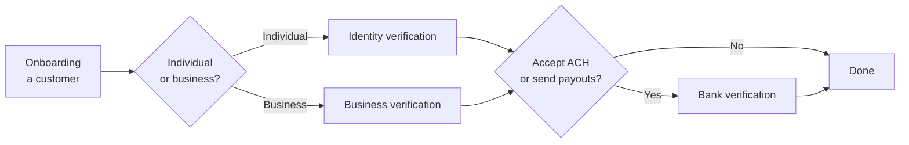

# Verification flows

Evolve verifies three different things — individuals, bank accounts, and businesses. They're separate flows with separate UIs and (often) separate fees, but they share one dashboard, one customer record, and one decision API.

Most teams start with **identity verification**. Add **bank account verification** when you take ACH or want to send payouts to consumers. Add **business verification** if you onboard businesses (marketplaces, B2B platforms, payouts to vendors).

## Pick a flow

<table data-view="cards"><thead><tr><th></th><th></th><th></th><th data-hidden data-card-target data-type="content-ref"></th></tr></thead><tbody><tr><td><h3><i class="fa-id-card" style="color:$primary;">:id-card:</i></h3></td><td><strong>Identity verification</strong></td><td>Document + selfie for individual customers.</td><td><a href="identity-verification/README.md">README.md</a></td></tr><tr><td><h3><i class="fa-building-columns" style="color:$primary;">:building-columns:</i></h3></td><td><strong>Bank account verification</strong></td><td>Confirm a bank account belongs to the customer.</td><td><a href="bank-account/README.md">README.md</a></td></tr><tr><td><h3><i class="fa-briefcase" style="color:$primary;">:briefcase:</i></h3></td><td><strong>Business verification (KYB)</strong></td><td>Verify a business and its beneficial owners.</td><td><a href="business/README.md">README.md</a></td></tr></tbody></table>

## A decision tree

## How the flows compose

The three flows aren't mutually exclusive. A typical marketplace onboarding might run all three:

1. **Business verification** on the seller entity (KYB).
2. **Identity verification** on each beneficial owner.
3. **Bank account verification** for the seller's payout account.

Evolve groups these into a **verification bundle** so they appear as a single onboarding case in the dashboard with one combined status. Bundles are configured in **Settings → Identity → Verification bundles**.

## What's gated by plan




**You're on Starter** — identity verification only. To add bank or business verification, [upgrade your plan](https://gitbook.com).







**You're on Growth** — identity and bank verification are enabled. Business verification is an Enterprise feature.







**You're on Enterprise** — all flows enabled, including watchlist and PEP screening on identity verification.




| Flow | Starter | Growth | Enterprise |
| --- | :---: | :---: | :---: |
| Identity (document + selfie) | ✅ | ✅ | ✅ |
| Bank account (Plaid + micro-deposits) | — | ✅ | ✅ |
| Business verification (KYB) | — | — | ✅ |
| Watchlist + PEP screening | — | — | ✅ |
| Volume cap | 100/mo | 1,000/mo | Custom |

## How verifications appear in the dashboard

Every verification — regardless of flow — lands in **Identity → All sessions**. The session row shows the flow, the subject (customer or business), the status, and the time. Click in to see the full timeline of checks, the documents collected, and the final decision with reasoning.

The **All sessions** view filters by status, flow, and customer cohort, and exports to CSV the same way [Payments reports](https://app.gitbook.com/s/w3LlITSOQye8o4wjsQXV/reporting/standard-reports) do.

## Re-verification

Verifications aren't permanent. Some teams re-verify on a schedule (every 12 months for high-risk customers), some only on a specific signal (chargeback, account takeover suspicion, large transaction). Evolve's re-verification API lets you trigger a fresh flow against an existing customer; the result is added to their session history without overwriting the prior decision.

For the policy patterns most teams use, see [Compliance → Regional requirements](../compliance/regional-requirements.md#re-verification-cadence).
