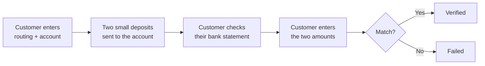

# Micro-deposits

Micro-deposits work for any US bank account, including the ~30% that aren't covered by Plaid. The trade-off is speed — they take 1–2 business days to land, and the customer has to come back to confirm the amounts they received.

Use them as a fallback for [Plaid instant](plaid-instant.md), or as your primary method if you serve customers at smaller banks and credit unions.

## How it works

## What the customer experiences

It's a two-step flow with a 1–2 day gap in between:




### Day 1: Submit account details

The customer enters their routing number and account number on your verification flow. Evolve confirms the routing number is valid and the account exists, then schedules two small deposits — typically $0.01 to $0.99 each — to land in the account.

The customer is told to come back within 7 days, and an email reminder fires after 2 and 5 days if they haven't returned.





### Day 2 or 3: Confirm amounts

The customer checks their bank statement (or app), sees two deposits from "EVOLVE-VERIFY", and returns to your verification flow. They enter the two amounts. If they match, the verification succeeds.




## Failure modes

The customer has up to 3 attempts to enter the right amounts. After the third wrong attempt, the verification fails and the customer is locked out for 24 hours.

Other failures:

Customer never returns

After 7 days without the customer entering the amounts, the verification expires. You can resend the flow with a fresh pair of deposits, but you'll be charged for the new attempt.

Deposits don't land

The deposits can fail (closed account, frozen account, mistyped routing/account number) — you'll get a `bank_verification.failed` webhook with the bank's reason code. Re-send the flow if it was a typo; otherwise the customer needs to use a different account.

Wrong amounts entered

If the customer enters the wrong amounts three times, the verification fails. This sometimes catches typos, sometimes catches fraud — someone trying to verify an account they don't own.

## When it's the right choice

Use micro-deposits when:

* You're verifying a US bank account at a smaller institution.
* Plaid was attempted and failed.
* Cost matters — at $0.80 vs $2.50 for Plaid, micro-deposits add up at volume.
* The customer is patient (B2B onboarding, marketplace seller signup) and the 1–2 day delay is acceptable.

Don't use micro-deposits as the primary method when:

* The customer needs to transact immediately (consumer checkout, real-time onboarding).
* You're paying out the customer in the next business day — you'd verify the account *after* paying out, defeating the point.

## Costs and limits

| | |
| --- | --- |
| **Cost per verification** | $0.80 |
| **Speed** | 1–2 business days |
| **Coverage** | Any US bank with valid ABA routing |
| **Re-verification** | Free for 90 days after initial |
| **Customer attempts** | 3 before lockout |

## What you get back

The same data as Plaid — masked account number, routing, account type, account holder name. Micro-deposits don't return balance or risk signals (no online banking session is opened), so you'll get less context.

## Related

* [Plaid instant](plaid-instant.md) — the faster option when supported.
* [Bank account verification](README.md) — parent flow.
* [Payments / Money movement](https://app.gitbook.com/s/w3LlITSOQye8o4wjsQXV/concepts/money-movement) — using a verified account for ACH.
