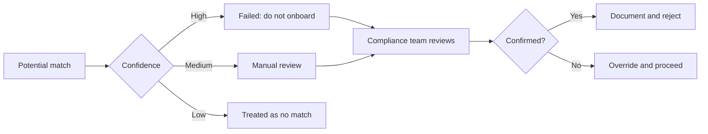

# Sanctions screening

Sanctions screening checks both a business and its [beneficial owners](beneficial-ownership.md) against the lists of entities and individuals that governments restrict you from doing business with. It runs automatically as part of every [KYB verification](README.md), and continues running on a schedule for as long as the business is active in your account.

The lists matter. Onboarding a sanctioned business is a regulatory violation, not just a fraud problem — fines run to the millions per incident, and personal liability can attach to specific compliance officers.

## Lists Evolve checks against

| List | Issued by | Coverage |
| --- | --- | --- |
| **OFAC SDN** | US Treasury | Specially Designated Nationals — the most-cited US sanctions list |
| **OFAC sectoral** | US Treasury | Sector-specific sanctions (e.g. Russian financial sector) |
| **OFAC consolidated** | US Treasury | All other OFAC programs combined |
| **UN consolidated** | United Nations | UN Security Council sanctions |
| **EU consolidated** | European Council | EU restrictive measures |
| **UK HMT** | UK HM Treasury | UK financial sanctions |
| **DPL / EAR** | US Commerce | Denied Persons List, export controls |
| **Country-specific** | Various | ~40 national lists (Canada, Australia, Singapore, etc.) |
| **Adverse media** | Aggregated news | News mentions tied to financial crime risks |

The full list with version timestamps is in **Settings → Identity → Sanctions sources**. Evolve refreshes from each source daily.

## How matching works

A "match" isn't a literal string match — names on sanctions lists vary in spelling, transliteration, name order, and inclusion of middle names or patronyms. Evolve's matcher handles:

* **Romanization variants** — Mohammed / Mohammad / Muhammad / Mohamed.
* **Word order** — last-first vs first-last conventions across cultures.
* **Diacritic stripping** — Müller and Mueller treated as the same.
* **Diminutives** — Bill / William, Bob / Robert (English only).
* **Middle name handling** — John H. Smith and John Henry Smith match.
* **Date-of-birth confirmation** — narrows false positives by requiring DOB within a tolerance.

The result is a confidence score per potential match. Above the high-confidence threshold (default 0.92), the verification fails. Between 0.75 and 0.92, it goes to manual review. Below 0.75, it's treated as a non-match.

You can tune these thresholds per-tenant in **Settings → Identity → Sanctions sensitivity**. Lower thresholds catch more (but flood you with false positives); higher thresholds catch less (and miss true matches).

## When something matches

A match — even at high confidence — isn't always a true positive. The decision tree:

For high-confidence matches, the right default is to refuse the onboarding and document the reason. For medium-confidence matches that turn out to be false positives — there are a lot of John Smiths in the world — your compliance team can override the match with a documented reason and proceed.

Every override is permanently logged in the [audit log](../../compliance/audit-logs.md), with the operator's identity, the match details, and the stated reason. This is the trail your auditor will want.

## Ongoing monitoring

A clear screening result today doesn't stay clear forever. Evolve re-screens every active business **weekly** against fresh list snapshots. When a previously verified owner or business is added to a list:

* `screening.match_added` webhook fires immediately.
* The business is flagged in the dashboard with a red banner.
* Your compliance team receives an alert email.

You decide what to do — most teams suspend the business pending review and offboard if the match is confirmed.

The cost of ongoing monitoring is included with the original KYB at no extra fee, for as long as the business is active.

## What you can configure

Per your compliance program's needs:

* **List subset** — turn off lists that don't apply. Some teams skip adverse media because of the false-positive rate.
* **Confidence thresholds** — tighten or loosen.
* **Date-of-birth tolerance** — typically ±2 years; tighten for higher-risk businesses.
* **Geographic scope** — focus screening on businesses in countries you operate in.

## Adverse media specifics

Adverse media is the loosest screening category and produces the most false positives, because it's drawn from open-source news rather than maintained government lists. We recommend treating adverse media matches as **manual review only**, never as automatic rejection.

The categories of news Evolve flags:

* Money laundering and structuring
* Terrorism financing
* Human trafficking
* Sanctions evasion
* Cyber-crime and fraud
* Bribery and corruption
* Tax evasion

You can turn off specific categories in **Settings → Identity → Adverse media → Categories**.

## Related

* [Beneficial ownership](beneficial-ownership.md) — owners are screened individually.
* [Watchlist screening](../identity-verification/watchlist-screening.md) — the equivalent for individual identity verifications.
* [Audit logs](../../compliance/audit-logs.md) — every screening decision is logged.
* [Regional requirements](../../compliance/regional-requirements.md) — country-by-country sanctions obligations.
