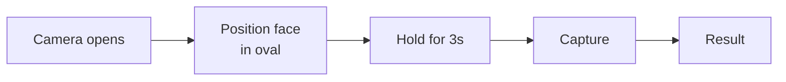

# Selfie and liveness

The selfie-and-liveness check is the second half of an identity verification. It confirms two things: that the person in front of the camera is the same person on the document, and that the camera is seeing a live human (not a photo, video, mask, or deepfake).

Evolve's current implementation is **passive liveness 2.0** — no head turns, no smile-on-command, no spelling out numbers. The customer just holds the camera in front of their face for about three seconds. The model decides liveness from subtle signals (skin texture, micro-movements, lighting consistency) without asking the customer to do anything.

## What gets compared

The check produces two scores:

| Score | What it means | Threshold (Standard preset) |
| --- | --- | --- |
| **Match score** | Similarity between the selfie and the photo on the document. 0.0 (no match) to 1.0 (identical). | ≥ 0.85 to pass |
| **Liveness score** | Confidence the selfie is from a live human. 0.0 to 1.0. | ≥ 0.95 to pass |

Both scores are visible on the verification timeline. You can see at a glance whether a manual review is borderline (e.g. match score 0.83) or clearly fraudulent (match score 0.41).

## What the customer sees

The whole step takes under 10 seconds end to end. The model needs about 3 seconds of stable video to make a confident liveness call.

If the customer's environment is bad (very dim, very bright, blurry camera), the flow detects it and prompts a retry before submission. This avoids "fail and ask the customer to start over" loops.

## Failure reasons

selfie_mismatch

The face on the selfie doesn't match the photo on the document. This can be a real fraud signal, or a benign issue — different hairstyle, face mask in the document photo, large age gap between document issuance and now. Borderline cases (match score between 0.65 and 0.85) go to manual review.

liveness_failed

The model is confident it's not seeing a live human. Usually a photo of a photo (replay attack), a video held in front of the camera, or a high-quality mask. Treated as a fraud signal — the customer is locked out of retries until manually approved.

capture_quality

The selfie was too dark, too blurry, or too occluded to score reliably. Customer can retry; this isn't a fraud signal.

customer_abandoned

The customer started the selfie step but didn't complete it within 5 minutes. The verification is left in `pending` until they return, or until 24 hours later when it auto-expires.

## Spoof attempt detection

Evolve's liveness model is hardened against the common attack patterns:

* **Photo of a photo** (printed picture held to camera) — detected via texture and reflection analysis.
* **Video replay** (recorded selfie played from another phone) — detected via screen moiré patterns and frame-to-frame consistency.
* **Mask attacks** (silicone or printed masks) — detected via micro-movement and depth cues.
* **Deepfakes** (real-time face-swap models) — detected via specific artifacts that differ from real cameras.

Detected spoofs land on the verification timeline as `spoof_detected` with the attack type. They're also surfaced in the [audit log](../../compliance/audit-logs.md) and can be alerted on via webhook.

## When liveness isn't required

For some product flows, you may want the document check without the selfie — for example, age verification on adult-only content where the document is sufficient. In **Settings → Identity → Required checks**, you can untoggle the selfie requirement per flow type.

## Privacy

Selfies are processed in memory for liveness scoring and discarded — only the score is retained. The match comparison against the document photo also produces only a score, not a stored embedding. Per your [retention policy](../../compliance/data-retention.md), the selfie image itself can be retained for review or auto-purged immediately.

## Accessibility

The selfie flow has been designed for accessibility:

* No timed gestures or tasks.
* Voice and screen-reader prompts walk the customer through positioning.
* High-contrast mode and large-text mode available.
* If a customer can't complete a selfie at all (camera-blind, severe motor impairment, no functional camera), the flow offers a manual-review path with an alternative ID document upload.

## Related

* [Document review](document-review.md) — the first half of identity verification.
* [Identity verification](README.md) — the parent flow.
* [Watchlist screening](watchlist-screening.md) — optional Enterprise screening layer.
