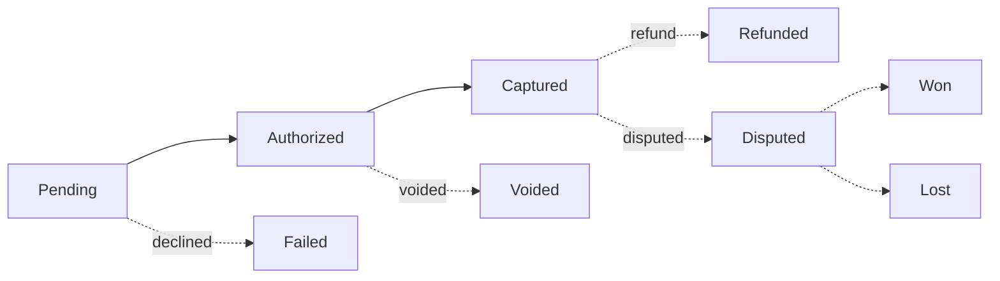

# Payment lifecycle

Every payment in Evolve moves through a predictable sequence of states. The dashboard shows the current state as a badge on the payment row, and the full state history on the timeline view.

The most important distinction to understand is between **authorized** (the issuer has approved the charge but funds are only on hold) and **captured** (funds are moving to your account). Most charges authorize and capture in one step — but for pre-orders, marketplaces, and hospitality holds, you can split them.

## The states

| State | What it means | Funds impact | Dashboard badge |
| --- | --- | --- | --- |
| Pending | Sent to the network, waiting on issuer response. | None yet. | Grey |
| Authorized | Issuer approved; funds are held, not moved. | Customer's available balance is reduced. | Yellow |
| Captured | The hold has been settled — funds are moving to you. | Counts toward your next [payout](money-movement.md). | Green |
| Failed | Issuer declined. The decline reason is on the timeline. | None. | Red |
| Voided | Authorization released before capture. | Hold reversed. | Grey |
| Refunded | Captured funds returned to the customer. | Reduces your next payout. | Blue |
| Disputed | Cardholder filed a chargeback. | Funds withheld pending outcome. | Orange |

## Authorize-then-capture

By default, payments authorize and capture in a single step — the moment the customer confirms, the funds move. For some businesses that's not what you want:

* **Pre-orders** — authorize when the order is placed, capture when you ship.
* **Marketplaces** — authorize the buyer, capture once the seller fulfills.
* **Hospitality** — authorize an estimated total at check-in, capture the actual amount at check-out.

You can switch any payment link, Checkout session, or API call to two-step by toggling **Capture: manual**. You then have **up to 7 days** to capture before the authorization expires and the hold releases automatically.


Authorizations expire silently. There's no email or webhook for an expired auth. If you rely on long holds, set a reminder on your side to capture within the window.


## Watching state changes

Three places to track lifecycle events:

<table data-view="cards"><thead><tr><th></th><th></th><th></th><th data-hidden data-card-target data-type="content-ref"></th></tr></thead><tbody><tr><td><h3><i class="fa-list-timeline" style="color:$primary;">:list-timeline:</i></h3></td><td><strong>Dashboard timeline</strong></td><td>Visual history per payment.</td><td></td></tr><tr><td><h3><i class="fa-bolt" style="color:$primary;">:bolt:</i></h3></td><td><strong>Webhooks</strong></td><td>Push events to your own systems.</td><td><a href="https://app.gitbook.com/s/Si95BtOt1VRLWjT7A67V/webhooks">README.md</a></td></tr><tr><td><h3><i class="fa-chart-bar" style="color:$primary;">:chart-bar:</i></h3></td><td><strong>Reports</strong></td><td>Aggregate state counts over time.</td><td><a href="../reporting/standard-reports.md">standard-reports.md</a></td></tr></tbody></table>

## Related

* [Payment methods](payment-methods.md) — what each method supports.
* [Money movement and settlement](money-movement.md) — when captured funds become a payout.
* [Refunds](../reconciliation/refunds.md) — how refunds appear in the lifecycle.
