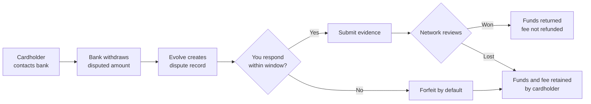

# Disputes and chargebacks

A dispute (or chargeback) is when a cardholder asks their bank to reverse a charge. The bank pulls the funds back from your account immediately and gives you a window to submit evidence that the charge was legitimate. Win, and the funds come back. Lose, and the funds stay with the cardholder along with a $15 dispute fee.

Disputes are the slowest, most expensive part of taking card payments. The good news is that most disputes are preventable, and many of the rest are winnable if you respond quickly.

## The lifecycle

## Dispute types

Not every dispute is a fraud claim. The reason code on the dispute matters — it tells you what evidence to gather:

| Type | Reason code examples | What the cardholder is claiming |
| --- | --- | --- |
| **Fraud** | `fraudulent`, `unrecognized` | They didn't make the charge |
| **Service** | `product_not_received`, `service_not_provided` | You didn't deliver |
| **Quality** | `defective`, `not_as_described` | What you delivered wasn't right |
| **Processing** | `duplicate`, `credit_not_processed` | Something went wrong with the transaction itself |
| **Authorization** | `general` | A catch-all the bank uses when the cardholder's reason doesn't fit elsewhere |

## Response window




**Enterprise customers** can configure a dispute alerts integration with Verifi or Ethoca. When enabled, you can resolve a fraud claim by issuing a pre-emptive refund within 72 hours and avoid the chargeback entirely. Talk to your account team to set this up.




You have **20 calendar days** from the dispute notification to submit evidence. After that, the network closes the case in the cardholder's favor by default.

The dashboard shows the deadline prominently on every open dispute, and we'll send three reminder emails — at 7 days, 3 days, and 1 day remaining.

## Responding from the dashboard




### Open the dispute

Disputes appear in **Reconciliation → Disputes**. Open one to see the disputed payment, the reason code, the cardholder's stated complaint (if available), and the response form.





### Decide: fight or accept

Two options:

* **Submit evidence** — you believe the charge was legitimate and you can prove it.
* **Accept the dispute** — you agree the cardholder is right (or it's not worth fighting). The funds stay with them, the fee stays with you. Often the right call for low-value disputes.





### Gather evidence

The form lists the evidence types most likely to win this reason code. For a `product_not_received` dispute on a physical product, that's typically:

* Shipping carrier and tracking number.
* Proof of delivery (signature, photo, or driver attestation).
* The order confirmation email sent to the cardholder.
* A copy of your refund and shipping policies.

For a digital product or service, it's different — IP address logs, login history, communication records.





### Submit

Once you submit, the response is locked. You can attach up to 10 files (PDF, PNG, JPG) and 5,000 characters of text. The network reviews in 30–75 days.




## Win rates by reason code

These are rough Evolve-wide averages — your numbers will depend on your evidence quality and product type.

| Reason code | Avg. win rate |
| --- | --- |
| `product_not_received` (with tracking) | 65% |
| `defective` / `not_as_described` | 30% |
| `duplicate` | 80% |
| `fraudulent` (with 3DS) | 45% |
| `fraudulent` (without 3DS) | 12% |
| `general` | 25% |

The biggest lever is [3-D Secure](../accept-payments/3d-secure.md) for fraud disputes — the liability shift means you almost always win when 3DS was used and the issuer authenticated the cardholder.

## Preventing disputes

Most disputes are preventable. The single most effective preventions:

Clear billing descriptors

The descriptor that appears on the cardholder's statement should be the brand name they recognize. "EVOLVE*ACME-CO" is recognizable; "MERCH 84920" is not. Set yours in **Settings → Billing → Statement descriptor**.

Easy refund flow

Most "fraud" disputes are actually friendly fraud — the cardholder didn't recognize the charge or couldn't figure out how to get a refund, so they called their bank. A visible, low-friction refund path on your site or in your receipts heads off most of these.

Proactive fraud prevention

Card-testing attacks (small charges from many fresh cards) generate fraud disputes weeks later. Evolve's risk rules block most of these automatically; check the Risk dashboard to see what's been blocked.

3-D Secure on high-value charges

For amounts over $500, the fraud-dispute math usually favors requiring 3DS — even with 1–2% checkout abandonment, the liability shift on disputes pays for itself.

## How disputes appear in your finances

The disputed amount is withdrawn from your balance the moment the dispute opens, not when it resolves. On the settlement file:

* **Dispute opens:** a `dispute_lost` row provisionally deducts the disputed amount + $15 fee.
* **Dispute won:** a `dispute_won` row credits the disputed amount back. The $15 fee is not refunded.
* **Dispute lost:** no further action — the provisional deduction becomes final.

This means your balance shows the worst-case outcome from the moment a dispute opens. If you win, the funds come back on the settlement file for the day the network ruled.

## Related

* [Settlement files](settlement-files.md) — how disputes show up in your daily reconciliation.
* [3-D Secure and SCA](../accept-payments/3d-secure.md) — the most effective dispute prevention.
* [Reporting](../reporting/standard-reports.md#dispute-report) — dispute rates over time.
