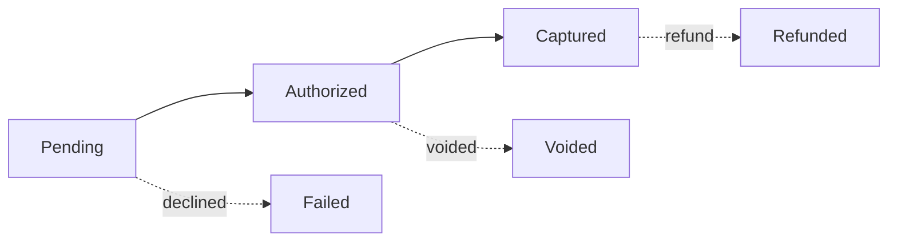
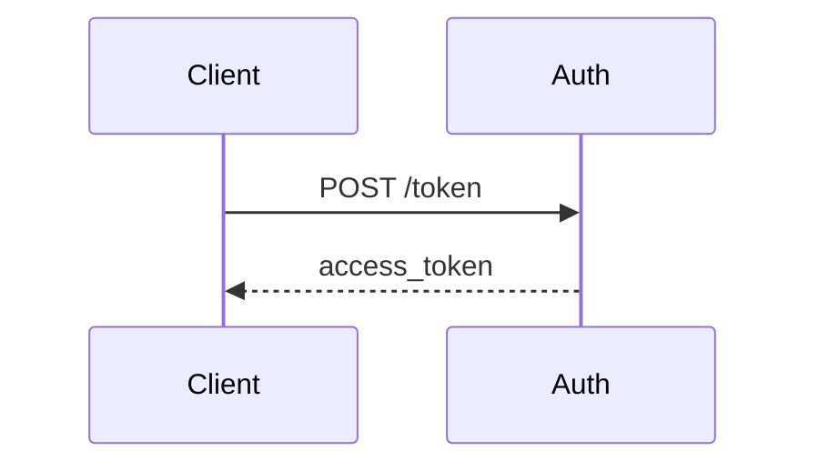
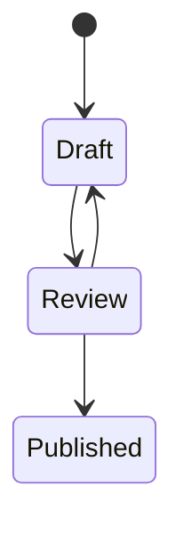
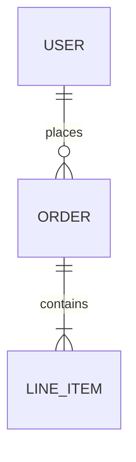

# Markdown syntax (GitBook flavor)

GitBook uses GitHub Flavored Markdown with custom extensions. This file covers standard markdown, code blocks, links, math, Mermaid diagrams, and SVG handling. For GitBook's ``-style custom blocks (tabs, hints, steppers, etc.), see `custom-blocks.md`.

## Contents

- Standard markdown
- Code blocks (basic + titled)
- Inline links
- Math / TeX
- Mermaid diagrams
- SVG handling (two pitfalls)
- Nested markdown inside custom blocks

## Standard markdown

```markdown
# Heading 1
## Heading 2
### Heading 3

**bold text**
*italic text*
`inline code`

- Bullet list item
- Another item
  - Nested item

1. Numbered list
2. Second item

[Link text](https://example.com)
[Internal link](getting-started.md)
```

## Code blocks

Basic fenced code blocks:

````markdown
```javascript
const foo = 'bar';
console.log(foo);
```
````

Code blocks with titles (GitBook extension):

````markdown

```javascript
const foo = 'bar';
console.log(foo);
```

````

## Inline links

- External links: `[text](https://example.com)`
- Internal pages (same space): relative file paths — `[text](page.md)`, `[text](../folder/page.md)`, or `[text](subfolder/page.md)`
- Email: `[text](mailto:email@example.com)`
- **Cross-space links**: relative paths don't work across space boundaries. Use `https://app.gitbook.com/s/<spaceId>/<path>`. If the space ID isn't known yet, use an `XSPACE_<KEY>` sentinel (see `cross-space-links.md`).

## Math / TeX

```markdown
Inline formula: $$E = mc^2$$

Block formula:

$$
E = mc^2
$$
```

## Mermaid diagrams

Any fenced code block with `mermaid` as the language renders as a diagram. Use Mermaid any time you'd otherwise reach for ASCII art or describe a relationship in prose where a picture would help.

````markdown







````

Common types:

- `flowchart LR` / `TD` — flows, decision trees
- `sequenceDiagram` — request/response, multi-actor flows
- `stateDiagram-v2` — formal state machines
- `erDiagram` — data models
- `gantt` — timelines

Standard Mermaid syntax — no GitBook-specific extensions.

## SVG handling (two pitfalls)

### `currentColor` doesn't resolve in referenced SVGs

`currentColor` only works when SVG markup is inlined directly into the page. Via `` the SVG renders standalone and `currentColor` falls back to black regardless of theme. For theme-aware icons, either inline the SVG or ship two variants and swap with `<picture>`:

```html
<picture>
  <source srcset=".gitbook/assets/icon-dark.svg" media="(prefers-color-scheme: dark)"/>
  
</picture>
```

### Keep `xmlns` on standalone SVG files

Some tools strip `xmlns="http://www.w3.org/2000/svg"` because it's redundant when SVG is inlined into HTML. But when the file is referenced via `` or `<picture>`, a missing `xmlns` causes the browser to parse it as plain XML and render nothing. The xmlns is only safely removable when SVGs are inlined. Keep it by default.

## Nested markdown inside custom blocks

Markdown formatting works inside custom block tags. Maintain standard markdown syntax within custom blocks:

````markdown


This tab contains markdown:

- Bullet points work
  - Nested bullets too
- **Bold text** and *italic text*
- `inline code`

```javascript
// Code blocks work too
const example = true;
```


````
