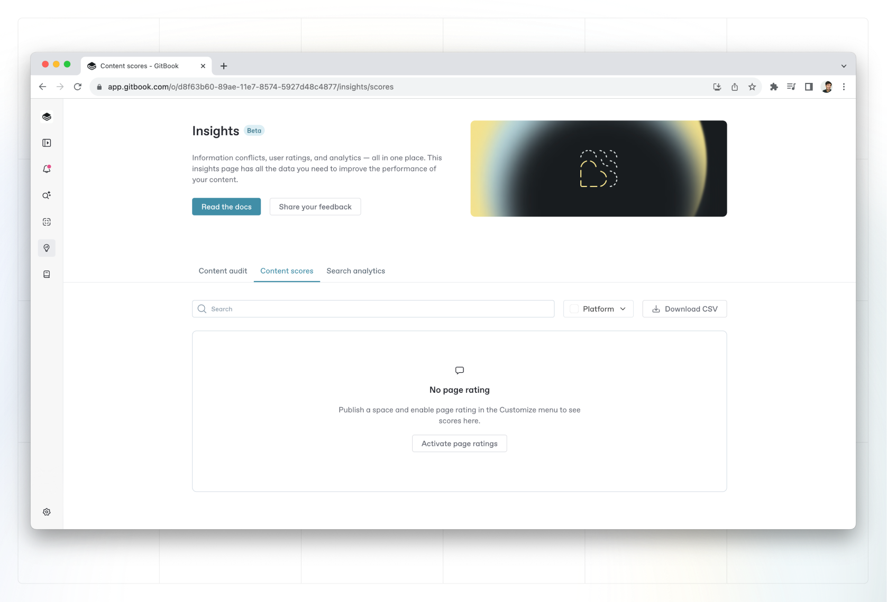
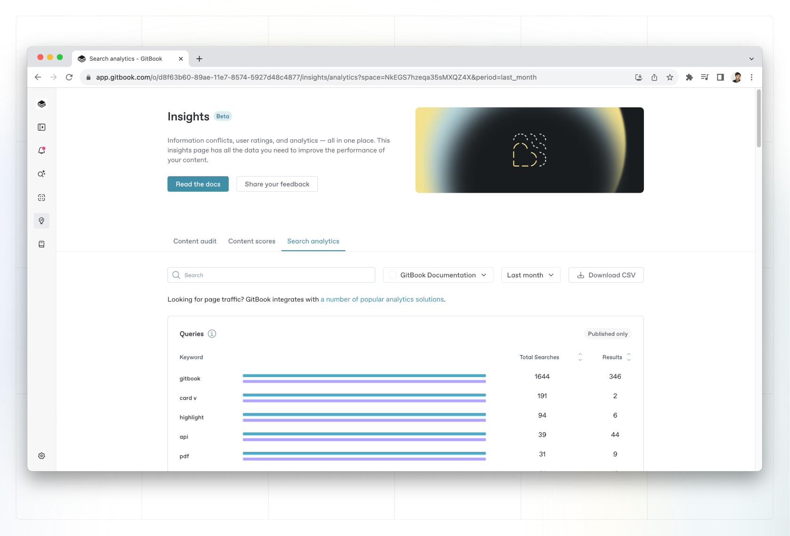

# Insights

Content insights give you a birds-eye view of all of the content you have in your organization — whether it’s your documentation, internal knowledge base, or another form of knowledge.

It’s split up into different sections — **content scores** and **search analytics**.

### Content scores

Content scores give you a high-level representation of how your users rate your content. After enabling [page rating](../published-documentation/customization/space-customization.md#page-rating) in the **Customize** menu for a space, you can see each page’s average feedback rating here.

Use the drop down menu on the right of the search bar to select the space you want to view. You can then hover over the average rating to see how many positive, neutral and negative ratings a specific page has.

If you want to use or analyze this data further outside of GitBook, click **Download CSV** to download a `.csv` file to your device.

#### How does GitBook calculate content scores?

GitBook uses a simple formula to calculate the page’s overall score:

`no. of ratings * (no. of positives - [0.5 * no. of neutrals] - [2 * no. of negatives])`

The goal of the content score is to surface the pages with the most feedback, with a bias towards negative ratings so you can see pages that need improvements. The more ratings a page has, the more the formula amplifies the sentiments of those ratings. This helps you spot pages that need attention, as well as pages that are highly-rated — to help you identify, iterate on and replicate your best content.

We cap the score at 500 (and -500) to avoid scores for commonly-rated pages reaching 10,000+.


**Why can’t I see any data for my space?**\
We only display data for published spaces. If your space is not published and does not have page ratings enabled, you won’t see any insights into this space.


<figure><figcaption>
In the <strong>Content scores</strong> tab, you can see which pages in a publish space have the highest and lowest ratings from your users.
</figcaption></figure>

### Search analytics

You can measure and improve your documentation by checking which keywords are used the most by users searching your documentation.

Switch to the **Search analytics** tab to see what keywords are performing the best, and which ones you could improve on. You can view these search terms for the past week, month, or year.

The information here can be helpful for informing your content architecture, making certain parts of your documentation easier to find without search, or adding additional content to existing pages based on what your visitors are searching for.

<figure><figcaption>
The <strong>Search analytics</strong> tab will show you what people are searching for most, and how many results they can find for those searches.
</figcaption></figure>

If you want to use or analyze this data further outside of GitBook, click **Download CSV** to download a `.csv` file to your device.

You’ll get information on:

`pageHits`: Total number of pages (title and description) matching the search term/query .

`sectionHits`: Total number of sections (contents of the pages) matching the search term/query.


**Why can’t I see any data for my space?**\
We only display data for published spaces. If your space is not published, you won’t see any insights into this space.


### Can I integrate GitBook with other analytics tools?

Outside of content insights, GitBook offers different [integrations](broken-reference/) for you to get more in-depth information about the behavior of visitors on your site. Head to our [integrations page](https://app.gitbook.com/integrations) to see which integrations you can use.

### What happened to Insights panel in individual spaces?

We think that [third-party analytics solutions](https://app.gitbook.com/integrations/\~/categories/analytics) offer much better and more detailed information when it comes to data like page views. So we removed page views as a data point in GitBook, and moved other space-wide insights into the **Insights** page.

If you want to track more analytics for your GitBook spaces, head to [our integrations page](https://app.gitbook.com/integrations/\~/categories/analytics) to see which you can use.
