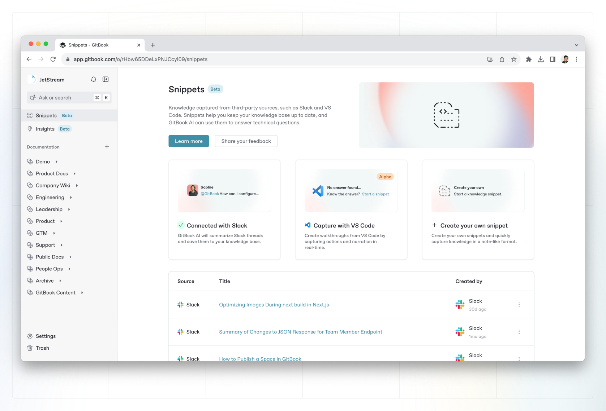
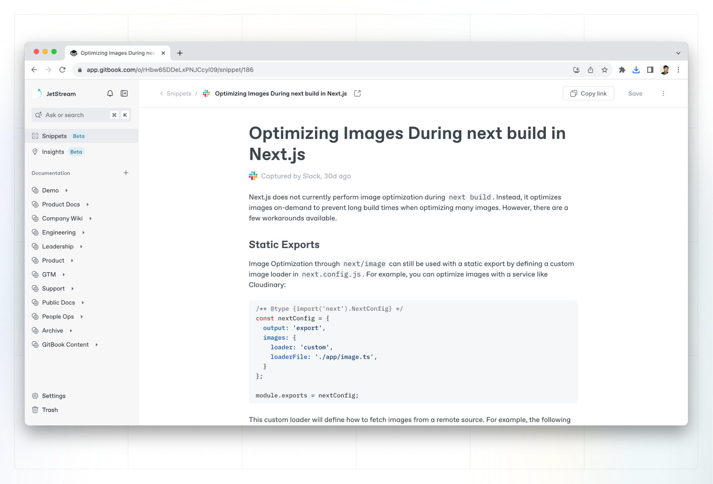

# Snippets (beta)

In GitBook, you can capture unstructured information using [integrations](broken-reference), and GitBook AI will turn it into a **snippet** — a structured page of information that’s easy to read and digest. You can also create snippets manually within the app.&#x20;

GitBook will index all of your snippets alongside the rest of your content, and can reference them when you or your team [searches for information](../content-editor/searching-your-content/). You can also merge snippets into existing docs or content to keep everything up to date.

<figure><figcaption>
The <strong>Snippets</strong> page holds all of your snippets in one place, and makes it easy to connect integrations so you can add more.
</figcaption></figure>

### Create a snippet

You can create snippets in GitBook in different ways, depending on the tool you’re using or the workspace you’re in.

#### Create a snippet from a third-party tool

You can capture snippets from third-party tools using integrations. Depending on the tool you’re using, you can add snippets in different ways. Find out more about capturing snippets in third-party tools in [the integrations section](broken-reference).&#x20;

Every snippet you add to your organization will end up in the **Snippets** page, along with information about it — such as its source, author, and when it was created.

#### Create a snippet manually

You can create a snippet manually from the **Snippets** page, by clicking the **Create your own** card. A blank page will appear and you can add any the information you’d like.

### Edit a snippet

You can edit a snippet you’ve captured by clicking to open it from the **Snippets** page. This will open an editor view, where you can edit any information that might be wrong, or add additional context for things that might be missing.


The snippet editor offers limited options, designed for basic edits to captured information. To access more editing options, you can copy the content of the snippet to a [page](../content-editor/editor/content-structure/content-in-a-space.md) in the **Documentation** section of your organization.


<figure><figcaption>
You can edit a snippet directly in the editor by opening itAdd.
</figcaption></figure>

### Share a snippet

You can share a snippet with others as a direct link to the organization it’s in. When viewing a snippet, you’ll find the **Copy link** button in the top-right corner.

### Delete a snippet

To delete a snippet, open it by clicking it in the **Snippets** page, then click the **Discard** option from the Action menu  in the upper right corner.


A snippet it is permanently deleted when you discard it.

