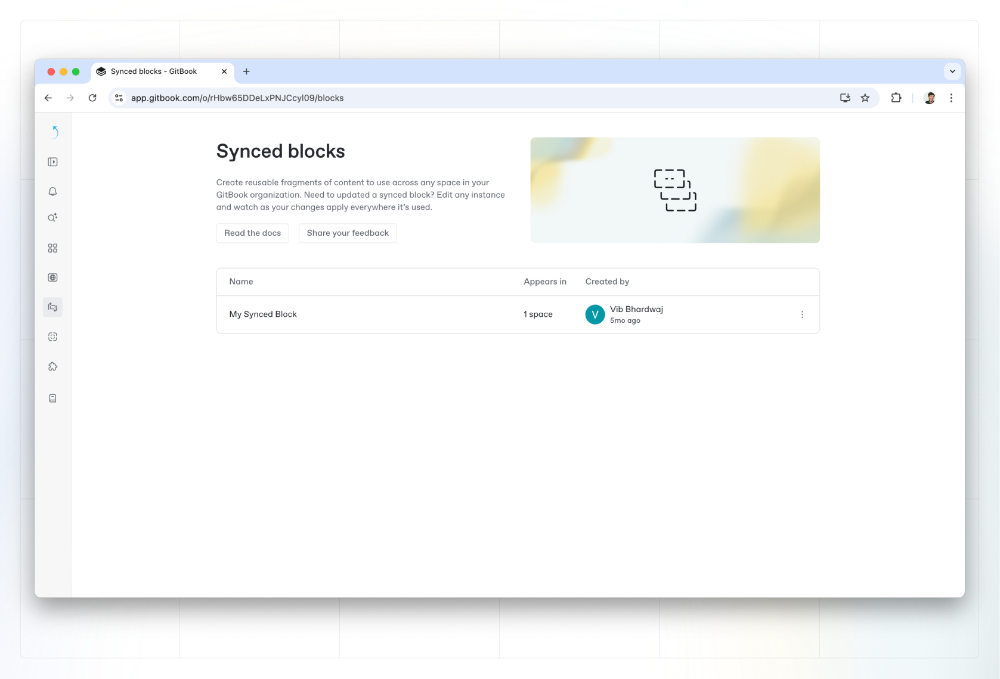
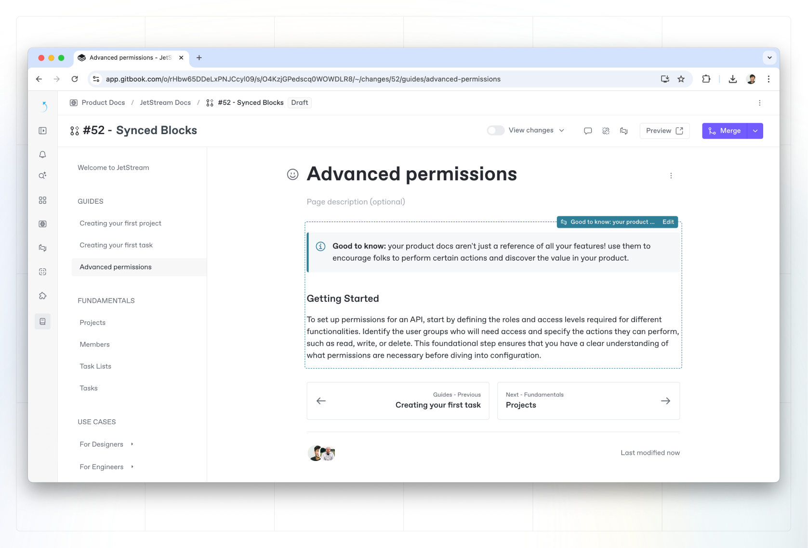
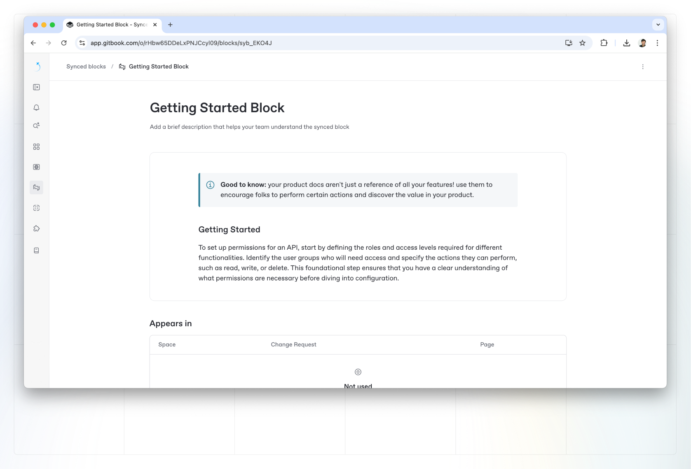

# Synced Blocks (beta)


This feature is available as part of the Pro plan and Enterprise plan. To find out more, [visit our pricing page](https://www.gitbook.com/pricing).


<figure><figcaption>
Synced Blocks Overview
</figcaption></figure>

Synced blocks let you sync content across multiple pages in GitBook, so you can edit all the instances of the block at the same time.

### **How to create a synced block**

To create a synced block, [select one or more blocks](../content-editor/blocks/#selecting-blocks-and-interacting-with-selected-blocks), then open the **Action menu**  and choose **Turn into a synced block**. You can then give your synced block a name to make it easier to find and reuse later.

Alternatively, you can select one or more blocks and then hit **Cmd+C** to open a prompt asking if you want to create a synced block.

If your synced block has instances on other pages, you can click the drop-down menu in the top-right corner of a synced block to see those locations.

<figure><figcaption></figcaption></figure>

### **Insert a synced block**

You can insert a synced block as you would with any other block. Hit `/` on an empty line to open the **Insert palette** and choose **Synced block**. Alternatively, click the `+` on the left of any block or empty line.&#x20;

You can choose the synced block you want to add from the list, or search for the one you need.

### **Editing a synced block**

You can edit a synced block from any instance by selecting the block and clicking **Edit**. This will bring you to the synced block's overview page, where you can edit the title, description, and block itself.

<figure><figcaption></figcaption></figure>


Changes you make to synced blocks that appear in published content will **automatically update in the published site**. Keep this in mind as you update synced blocks across your instances.


#### **In unpublished spaces**

Edits you make to a synced block in unpublished space will go live across its instances when you click **Done**. A modal will appear asking for confirmation of your changes before they updates appear.

#### **In change requests**

Editing a synced block inside of a change request will not update any of its instances until the change request is merged.&#x20;

### **Detach a synced block**

You can detach a synced block by opening the **Action menu**  and selecting **Detach instance**. Detaching an instance of a synced block will only detach it in the current page.

Once detached, any changes you make to the block(s) will not be reflected across the other instances, and changes you make in those instances will not be reflected in the detached block(s).

### Delete a synced block

You can delete a synced block from the synced blocks overview page. Select the **Action menu**  next to the block you’d like to delete, and select **Delete**.

If the block is used across any of your spaces, a warning message will appear. Deleting a synced block that is used across spaces will **delete it from all spaces and sites it had appeared in**. This action cannot be undone.
