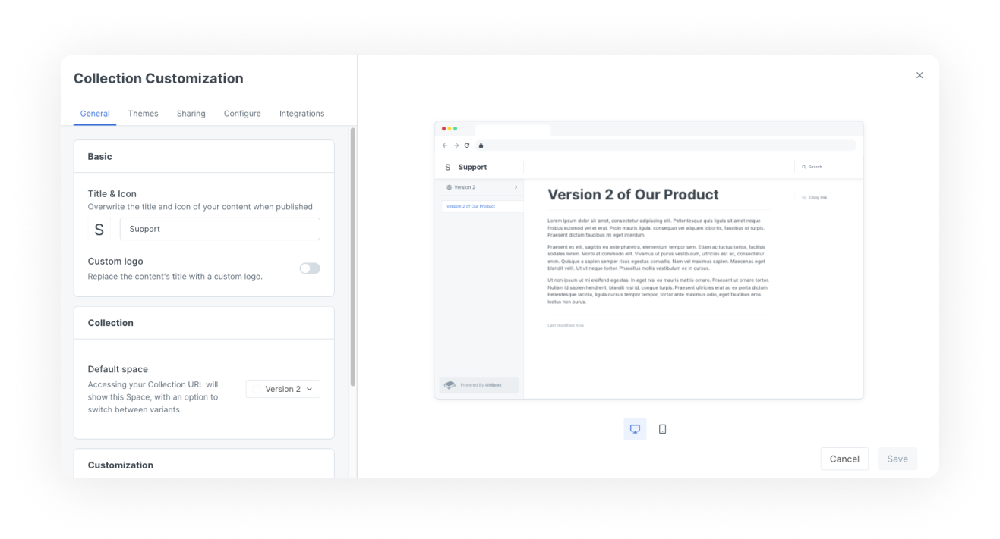

# Collection customization

<figure><figcaption>
Collection customization settings
</figcaption></figure>

Customizing a collection allows you to set top-level customizations that spaces within the collection can inherit. This is useful if you want to manage top-level customizations, letting you change customization options without having to change the settings for every space individually.

Customizing your collection lets you control the branding, presentation and extra features of your collection's published content.


Most customization settings apply to your **published content**. This keeps your writing experience and in-app GitBook content consistent, while allowing you to control the output to a degree.


## General

### Title and icon

The _internal_ title, which you'll see when logged into the GitBook app, is set on the collection page. In this customization setting you can override and choose different _external_ settings, which your visitors will see when they access your published content.

It's not uncommon to use a longer or more specific title in published content and to use a shorter title or internal wording that might not make complete sense to your visitors when logged into the GitBook app.

For the icon, you can choose from a long list of emojis, or you can upload your own square image.

### Custom logo

You can replace _both_ the collection's title and icon with a custom logo, so that your documentation better reflects your own branding.


The custom logo setting is only available to collections owned by an organization subscribed to a Pro or Enterprise plan.


### Default space

You can decide which space, or variant, visitors see right away when they navigate to your collection's URL. Visitors will have an option to switch between spaces/variants.

### Primary color

The chosen primary color will be applied to things like links, hover states, and buttons. While you can use any color you'd like, it's important to keep accessibility in mind and choose something that will have good contrast when used as a text link.

### Font family

You can customize the font family from a list of predefined options.

GitBook doesn't support the uploading or linking of custom fonts. If you think we're missing a typeface that works wonderfully for headers, body copy, and captions, [let us know](../../troubleshooting/support.md)!


The font family setting is only available to collections owned by an organization subscribed to a Pro or Enterprise plan.


### Theme mode

Choose between a light and a dark theme.


This setting only affects the published content. If you're looking to use a different theme when logged into the GitBook app, you can do so from your settings menu, found at the bottom of the [sidebar](https://docs.gitbook.com/getting-started/overview#sidebar).


## Themes

### Theme header options

We offer a number of header options for our theme:

1. **None**\
   This gives a more minimal look and feel. No [header links](collection-customization.md#undefined) will be visible, whether they have been configured or not, and the search option will be moved next to the space title or logo.
2. **Matching**\
   In light [theme mode](collection-customization.md#theme-mode), the header will have a light background. In dark [theme mode](collection-customization.md#theme-mode), the header will have a dark background.
3. **Bold**\
   The selected [primary color](collection-customization.md#primary-color) will be used for the header background.
4. **Contrast**\
   In light [theme mode](collection-customization.md#theme-mode), the header will have a dark background. In dark [theme mode](collection-customization.md#theme-mode), the header will have a light background.


The bold and contrast theme header options are only available to collections owned by an organization subscribed to a Pro or Enterprise plan.


## Sharing

### Social preview

You can upload a custom social preview image for your collection. This will set the space's `og:image` to be your uploaded image, and it'll show when the collection's link is shared to any platform or product that supports OpenGraph images.

## Configure

### Localize user interface

You can select from a list of languages to localize the user interface of your published content. This will apply translations to the **non-custom** areas of the interface.

This setting will not auto-translate your actual content, but can help with matching the user interface to the language that you are writing in.

Is there a language we don't yet offer that you would like to see included in this list? [Let us know](../../troubleshooting/support.md)!

### PDF export

You can choose whether or not you'd like visitors to your published content to be able to download the content as a PDF file.

You can [find out more about the PDF export feature](../pdf-export.md).


PDF export is only available to collections owned by an organization on a Pro or Enterprise plan.


### Page rating

Choose whether or not visitors to your published content can leave a rating on each page to let you know how they feel about it.

<figure><figcaption>
"Was this page helpful?" will show at the bottom of each page if this setting is enabled
</figcaption></figure>

You can review the results of this survey if you click on [insights](../insights.md) in the [space sub-navigation](https://docs.gitbook.com/getting-started/overview#space-sub-navigation) for each space in the collection.

### Header links

You can add links to the header section of your documentation. For each link, you will need to set a URL and a text label. You could use header links to link to important parts of your documentation, or perhaps to link back to your main website.


If your [theme header option](collection-customization.md#theme-header-options) is set to **none**, any header links you have configured will not be displayed. Make sure to choose one of the other theme header options so that your configured links are visible!


## Integrations

### Edit on GitHub/GitLab

When this setting is enabled, a link to edit each page directly in GitHub/GitLab will be displayed in the actions section in the right-hand column of the published content. Depending on how you have configured the repository, anyone who clicks this link may need to have been granted the necessary permissions to edit it.


The edit on GitHub/GitLab setting will only be displayed if [Git Sync](../../getting-started/git-sync/) has been configured.


### Google Analytics

GitBook's insights provide some high-level data around visits to your published documentation but, if you're looking for something more detailed, you can integrate with Google Analytics.

Start by generating a tracking ID in your Google Analytics dashboard, which can begin with either G- or UA-, and enter that ID into the field here. Next, you will need to enter a valid link to your privacy policy. This link will be used in a cookie consent pop-up so that visitors can better understand how cookies are being used.

Optionally, you can also enable the tracking of private views that come from within the GitBook app in addition to views of your published content.

Once you have included at least a tracking ID and a valid link to your privacy policy, click the **Connect** button. You will be able to view the results in your Google Analytics dashboard.

### Intercom

If you use Intercom, you might like to add a chat widget to your GitBook documentation so that visitors can quickly get answers to their questions.

First, you'll need to enter your Intercom application ID. You'll find this in your Intercom account, under the installation section of the settings page. Next, you will need to enter a valid link to your privacy policy. This link will be used in a cookie consent pop-up so that visitors can better understand how cookies are being used.

Once you have entered the application ID and a valid link to your privacy policy, click the **Connect** button. You can then configure any Intercom widgets you wish to use in your Intercom settings.
