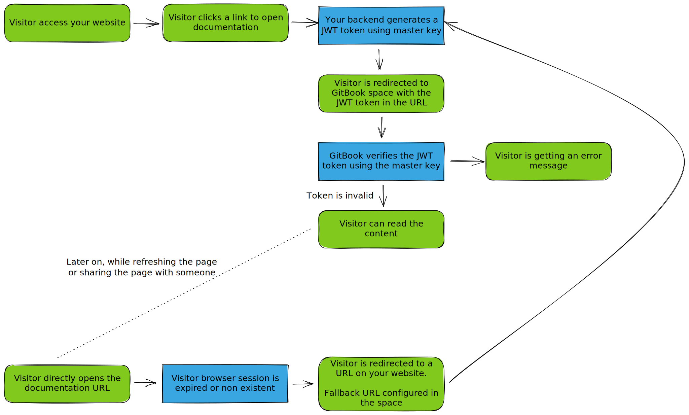

# Drawing

Drawings / sketches can be inserted from the insertion palette and are editable directly through GitBook using the integrated [Excalidraw](https://excalidraw.com/) editor.

Drawings are stored as special SVG files in the space. Those files have an extension of `drawing.svg`.

### Example of a drawing block

