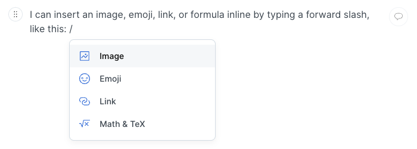

# Inline content

You can choose to insert inline content using the inline palette. This palette becomes available when you type a forward slash. The forward slash will be replaced by the inline content you choose to insert.

<figure><figcaption>
Inline palette
</figcaption></figure>

The inline palette offers the following options:

* [Image](image.md)
* [Emoji](emoji.md)
* [Link](link.md)
* [Math & TeX](math-and-tex.md)

