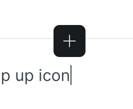

# Inline content

You can choose to insert inline content using the inline palette:&#x20;

<figure><figcaption>
Inline palette
</figcaption></figure>

This option becomes available as you place your cursor in your content in editing mode. When you click the icon it gives you the following options:

* [Image](image.md)
* [Emoji](emoji.md)
* [Link](link.md)
* [Math & TeX](math-and-tex.md)

