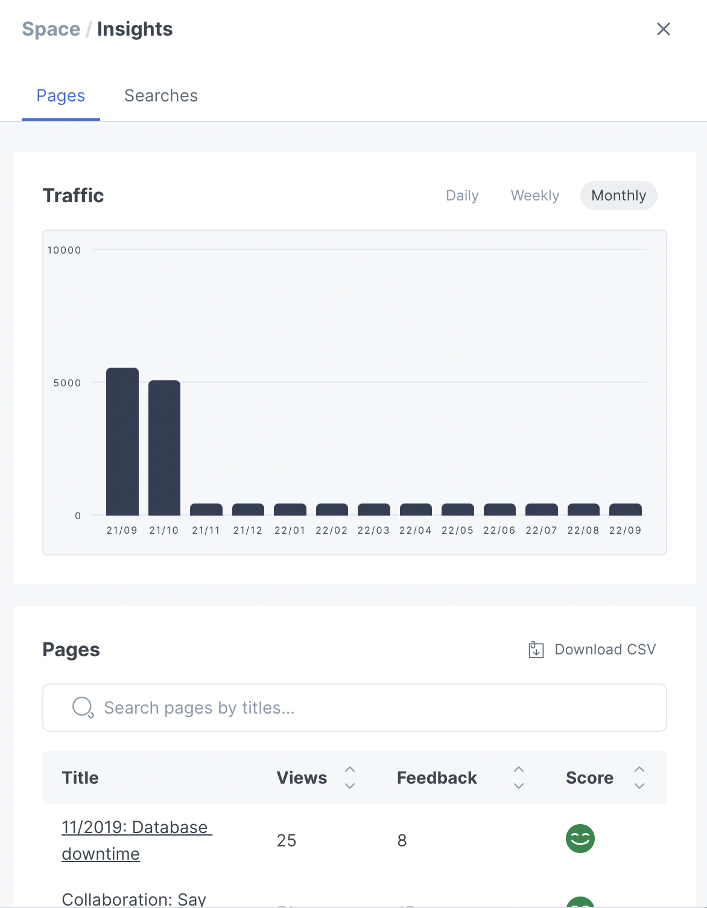

# Insights

You can measure and improve your documentation by checking how your pages are performing and which keywords are used when searching through your documentation.


**Permissions**

Administrators and Creators can view the Insights panel.


## The insights panel

When inside of a space, click on "Insights" in the top menu to open the insights panel. If you can't see the "Insights" link, you might not have the correct permission level. Only Administrators and Creators can view the Insights panel.

<figure><figcaption>
The insights panel
</figcaption></figure>

### Pages

#### Traffic

Here you can see overall traffic to your space. You can select from daily, weekly, or monthly traffic. A bar chart is displayed, plotting the traffic over time. &#x20;

#### Pages

Here you can see page views broken down by each page in your space. The "Views" count is the total views since the page was published. You can also see how many people have left [feedback](customization/space-customization.md#page-rating) on each page and the average feedback rating.

You can download this insight data as a `.csv` file for your own use and analysis by clicking "Download CSV".

### Search

In the 'Searches' tab within the insights panel, you can view the search terms that have been most popular in your space. You can use this information to inform your content architecture, make certain parts of your docs easier to find without search, or even add additional content based on what your readers are searching for.

You can download this insight data as a `.csv` file for your own use and analysis by clicking "Download CSV".

## More insightful insights

GitBook default insights offer a quick overview of page views. To take a deeper look into your readers' behavior, you should take a look at our [Google Analytics](customization/space-customization.md#google-analytics) integration.

## **Data sampling**

In data analysis, sampling is the practice of analyzing a subset of all data in order to uncover the meaningful information in the larger data set. For example, if you wanted to estimate the number of trees in a 100-acre area where the distribution of trees was fairly uniform, you could count the number of trees in 1 acre and multiply by 100, or count the trees in a half acre and multiply by 200 to get an accurate representation of the entire 100 acres.

**GitBook Insights** applies session sampling to your data in order to give you accurate reports in a timely fashion. The direct consequence is no page views are shown for new spaces or spaces with a low number of page views.
