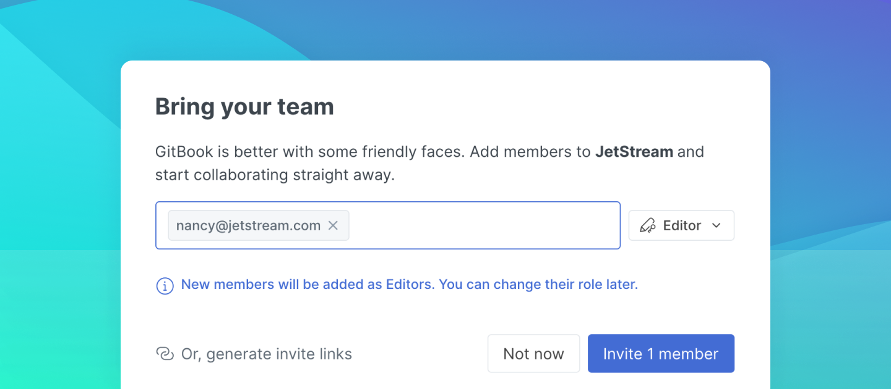

# Member management

You can invite and remove members from your organization, change members' roles and permissions, and manage "[Teams](teams.md#creating-and-managing-teams)" of members from the Members page in your organization's settings.


**Permissions**

Admins can invite and remove members, change members' roles and permissions and manage Teams. Creators can manage permissions at a content level.


### Learn more about:

| 
<strong></strong><a href="roles.md"><strong>Member roles</strong></a> Learn about the different member roles in GitBook
                   |
| --------------------------------------------------------------------------------------------------------------------------------------------------- |
| 
<a href="teams.md"><strong>Teams</strong></a><strong></strong> <strong></strong>Learn about using teams to organize your members
          |
| 
<a href="permissions-and-inheritance.md"><strong>Permissions and inheritance</strong></a> Learn about content permissions and inheritance
 |

## Invite members to your organization

There are a number of ways you can invite new members to your organisation:

* Generating an invite link and sharing it directly
* Inviting them directly using their email address

### Managing invite links

Invite links in GitBook allow you to maintain a list of links that members can use to sign up and quickly join your organization.

Invite links are tied to specific [roles](roles.md) – and you can create (and revoke!) as many invite links as you like.

### Inviting members directly

You can directly invite members in the Members section of your organization settings. Enter their email(s), select their default role, and hit 'Send Invites' and you're good to go. Each member will receive an email that will allow them to sign up to GitBook and instantly join your organization.

## Remove members

Teams change all the time, sometimes there are new members joining 🤗 and some of them go. 😢

### Leave an organization

You can leave an organization by clicking on your `organization's settings > Leave organization.`

### Remove a member

Organization admins can remove a member of a team through the members list in the Members section of the organization settings.
