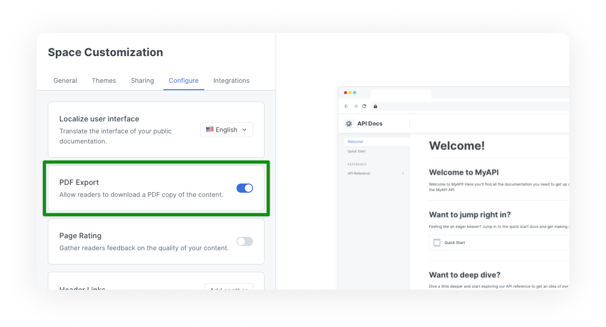
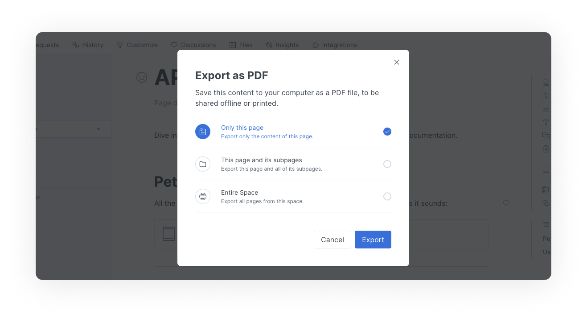
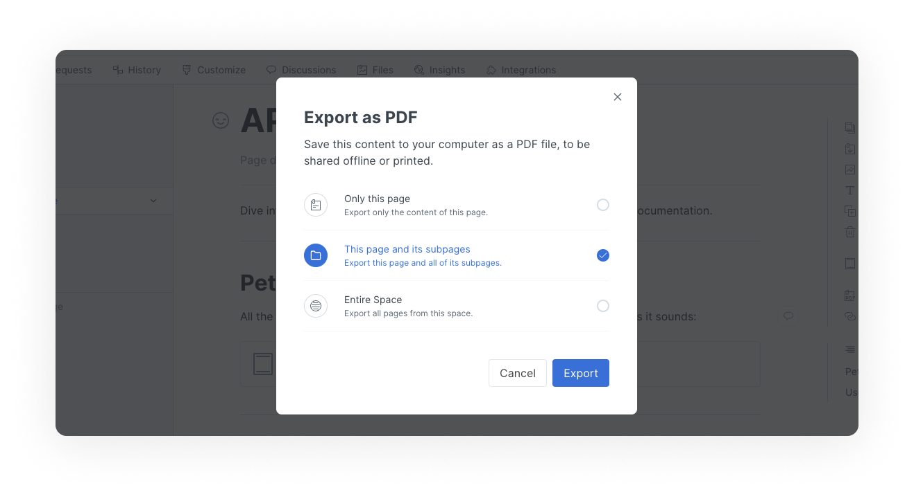
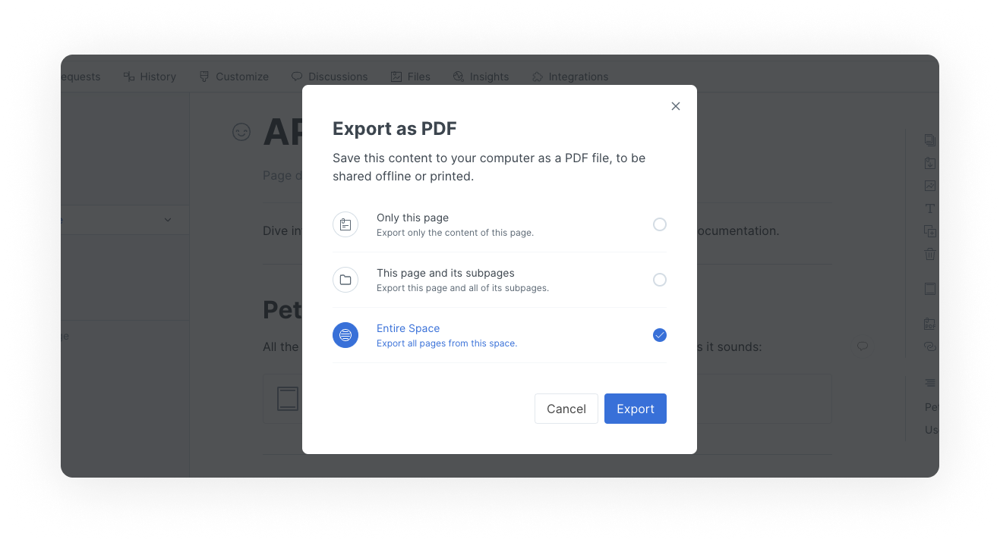

# PDF export

PDF export is a beta feature, available with a **Pro** or **Enterprise** plan. It allows:

1. Visitors to your published content to download the space as a PDF file.
2. You and other logged-in users to export a single page, a page with its subpages, or an entire space as a PDF file.


**Permissions**

Admins and creators can enable and disable PDF export for a space.


## Export settings

To enable or disable PDF export, head to the settings for a space or collection. On the configure tab, you can enable or disable the PDF export setting. This setting determines whether or not **readers of your published content can download it in PDF format**.

<figure><figcaption>
Enable or disable PDF export for your published content
</figcaption></figure>

## Export options

Regardless of the configured customization setting shown above, there are options for members of an organization on a Pro or Enterprise plan who are logged into the app to use the feature for spaces owned by an organization on a relevant plan. They will be able to export a page, page with its subpages, or an entire space as a PDF file.

### How to export an individual page

1. Make sure the space is in edit mode so that [page actions](https://docs.gitbook.com/getting-started/overview#page-actions) are displayed on the right hand side of the editor.
2. Go to the page that you would like to export, and click **export as PDF** in page actions.
3. Select **only this page**.
4. Click the **export** button.
5. Wait for the PDF file to be created, then click the **download** button.

<figure><figcaption>
Export "Only this page" as a PDF
</figcaption></figure>

### How to export a page and all of its subpages

1. Make sure the space is in edit mode so that [page actions](https://docs.gitbook.com/getting-started/overview#page-actions) are displayed on the right hand side of the editor.
2. Go to the parent page that you would like to export along with its subpages, and click **export as PDF** in page actions.
3. Select **this page and its subpages**.
4. Click the **export** button.
5. Wait for the PDF file to be created, then click the **download** button.

<figure><figcaption>
Export "This page and its subpages" as a PDF
</figcaption></figure>

### How to export an entire space

1. Make sure the space is in edit mode so that [page actions](https://docs.gitbook.com/getting-started/overview#page-actions) are displayed on the right hand side of the editor.
2. Go to any page within the space you'd like to export and click **export as PDF** in page actions.
3. Select **entire space**.
4. Click the **export** button.
5. Wait for the PDF file to be created, then click the **download** button.

<figure><figcaption>
Export "Entire Space" as a PDF
</figcaption></figure>
